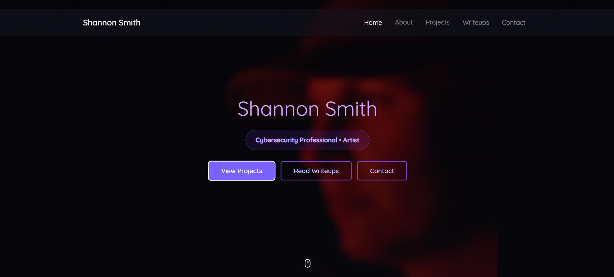

# Shannon Smith — Cybersecurity Portfolio

🌐 **Live Site:**  
https://shannonasmith.github.io/

  

---

## Overview

This repository contains the source code for my personal cybersecurity portfolio site.

The goal of this site is to document **hands-on security investigations, technical projects, and academic work** while presenting them in a clear, structured format.

My background combines **software development, cybersecurity investigations, and systems thinking**, and this portfolio reflects that blend of disciplines.

---

## About Me

I'm a cybersecurity professional and U.S. Navy veteran with a background in software development and systems thinking. I recently completed a **Master of Information Technology at Virginia Tech**, with additional graduate certificates in **Software Development** and **Cybersecurity Policy**.

My path into cybersecurity has been driven by curiosity and hands-on exploration. I’ve been building practical experience through **security labs, Capture-the-Flag challenges, home lab experimentation, and technical investigations**. These exercises allow me to practice real security skills such as **log analysis, artifact investigation, system analysis, and understanding attacker behavior**.

Before transitioning fully into cybersecurity, I developed a strong technical foundation through software development projects involving **Java, Kotlin, web applications, and object-oriented design**. That background continues to support my approach to security by strengthening my **debugging, automation, and systems analysis skills**.

This repository and portfolio document my ongoing learning through **CTF investigations, cybersecurity research, and technical projects**.

---

## Focus Areas

The site highlights several categories of work:

### CTF Investigations

Structured writeups and investigations from Capture-the-Flag challenges focused on:

- Web exploitation  
- Artifact analysis  
- Encoding / cryptography challenges  
- Log investigation  
- System analysis  

Each investigation emphasizes **methodology, evidence, and conclusions**, mirroring real-world security analysis.

---

### DFIR & Log Analysis

Projects exploring:

- Authentication log analysis  
- Event correlation  
- Timeline reconstruction  
- Suspicious activity investigation  

These exercises focus on **understanding attacker behavior and identifying evidence within system logs.**

---

### Home Lab Engineering

An evolving cybersecurity lab environment used for experimentation and learning.

Technologies and areas explored include:

- pfSense firewall configuration  
- Linux systems and CLI investigation  
- Network traffic analysis  
- ELK stack log analysis  
- Security tooling experimentation  

---

### Software & Development Projects

Academic and personal development projects that support my cybersecurity work.

Examples include:

- **DuckSim** — object-oriented design patterns and interactive behavior  
- **Dreamcatcher** — Kotlin mobile application with database integration  
- **Tetris AI** — algorithmic decision making and testing  
- **Dots and Boxes** — Java game logic and GUI design  
- **E-Commerce Bookstore** — full web application project  

These projects strengthened my foundation in **programming, debugging, and structured problem solving.**

---

### Academic Cybersecurity Research

Selected research and presentations from graduate coursework.

Topics include:

- NotPetya malware analysis  
- Wizard Spider threat group  
- Uber / Lapsus$ breach analysis  
- Cyberbullying and cyber policy  
- Security planning and Scrum project management  

---

## Certifications

My professional cybersecurity certifications can be verified on Credly:

🔗 **Credly Profile**  
https://www.credly.com/users/shannon-smith-it-usn

Current certifications include:

- GIAC Foundational Cybersecurity Technologies (GFACT)  
- Certified Ethical Hacker (CEH)  
- CompTIA Security+  
- CompTIA Linux+  
- Splunk Core Certified Power User  

Additional certifications and training are currently in progress.

---

## Education & Certifications Timeline

### 2025

**Cybersecurity Certifications**  
GFACT • CEH • Security+ • Linux+ • Splunk CCPU  

Built a stronger hands-on foundation in security operations, Linux administration, log analysis, and ethical hacking.

### 2023

**Master of Information Technology**  
Virginia Tech  

Graduate study with additional focus in software development and cybersecurity policy.

### Ongoing

**Current Study**  
SANS SEC401 (GSEC) • SANS SEC504 (GCIH) • CCNA  

Continuing to build network, enterprise security, and practical lab skills through study and projects.

---

## Contact

**GitHub**  
https://github.com/ShannonASmith

**LinkedIn**  
https://www.linkedin.com/in/ShannonASmith/

**Portfolio**  
https://shannonasmith.github.io/
