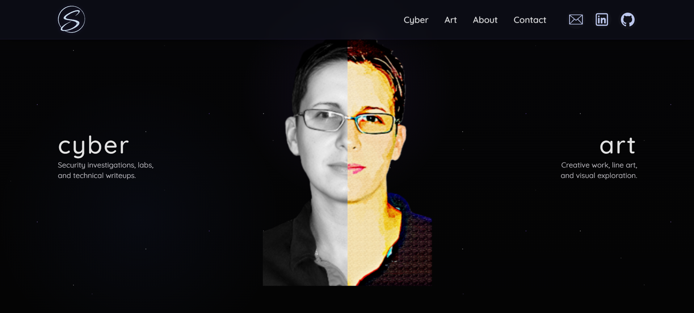

# shannonasmith.github.io

🌐 **Live site:** [shannonasmith.github.io](https://shannonasmith.github.io/)

Source code for my personal portfolio: a site built around the two sides of how I work, **cybersecurity and art**.

---

## The Concept

Most security portfolios show only the technical side. This one is built on a **cyber / art duality**: the analytical work of investigating systems next to the creative work (painting, drawing, photography, woodworking) that shapes how I approach problems. Patience, precision, and seeing patterns show up in both.

The design carries that idea through, from the split cyber/art portrait on the landing page to separate sections for each side.

---

## What's on the Site

| Page | What it covers |
|------|----------------|
| **Cyber** | CTF investigations, DFIR and log analysis, home lab engineering, and my SOC automation projects |
| **Art** | Paintings, drawings, and photography, with the story behind each piece |
| **About** | Background, U.S. Navy service, Virginia Tech coursework, and a certifications timeline |
| **Contact** | How to reach me |

Security write-ups focus on **methodology, evidence, and conclusions**. Some lab and CTF write-ups are summarized rather than published step by step, to respect the rules of the platforms they came from.

---

## Built With

- HTML, CSS, and JavaScript
- Hosted on **GitHub Pages**

---

## Roadmap

- Dedicated write-up pages for each project, replacing the current pop-up cards
- A Navy service page with photos from active duty
- Write-ups for selected Virginia Tech coursework projects
- A restructured About page with less emphasis on the timeline

---

## About Me

U.S. Navy veteran with a Master of IT from Virginia Tech, working in IT support and building toward security operations. Certifications include GSEC, GFACT, CEH, Security+, Linux+, and Splunk Core Certified Power User, with GCIH in progress.

More on my [GitHub profile](https://github.com/ShannonASmith) and [Credly](https://www.credly.com/users/shannon-smith-it-usn).

---

## Contact

- **Portfolio:** [shannonasmith.github.io](https://shannonasmith.github.io/)
- **LinkedIn:** [linkedin.com/in/ShannonASmith](https://www.linkedin.com/in/ShannonASmith/)
- **GitHub:** [github.com/ShannonASmith](https://github.com/ShannonASmith)
